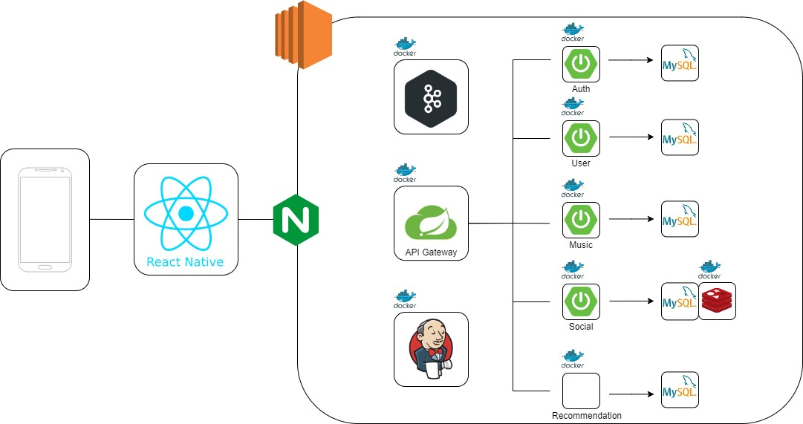
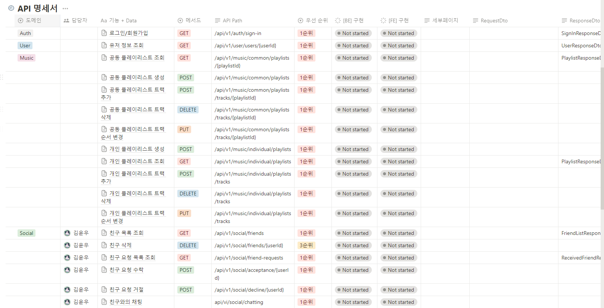

# Today I Learned(TIL) Wiki 완희

### 2023-10-12

- 교보재 신청
- 기획서 정리
- Spotify API 공식 문서를 보며 사용자 인증 절차에 대해 이해하고 코드로 구현해보았다.
- 인증 후 Access Token 을 받아 여러 API 테스트 완료

---

### 2023-10-13

- 비슷한 서비스를 검색하고 사용해보면서 우리의 서비스와의 차별점에 대해 찾고 우리가 처음 기획한 서비스에서 새로운 서비스로 재탄생하였다.
- 우리 서비스에 필요한 기능에 대해 MVP설정과 추가기능에 대한 우선순위를 부여하고 필요한 기술 스택이 무엇이 있을지 회의하였다.
- Spotify API 중 필요한 API에 대한 테스트 진행

---

### 2023-10-16

- 공동으로 플레이리스트를 작업하기 위해 공동의 작업자가 플레이리스트를 수정이 가능해야하는데 스포티파이에서 불가능하도록 제공하고있지 않았다.
- 회의를 통한 해결책으로는 공동작업자의 관계를 맺으면 호스트(먼저 플레이리스트를 만든 사람)의 토큰을 이용해서 플레이리스트를 수정하는 방향
- MVP 위주로 기능명세서를 작성하고 우선순위를 설정하였다.
- MSA 설계에 대해 가볍게 회의를 진행

---

### 2023-10-17

- 서비스 아키텍처 설계 및 작성

 

 - API 명세서 작성(MVP 위주로)

- 스포티파이 API 에서 플레이리스트 트랙 조회시 수많은 데이터 중 필요한 데이터를 선별

